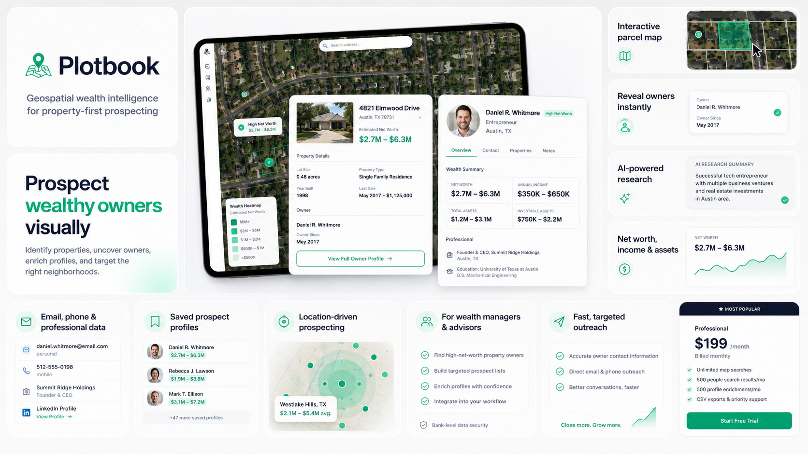
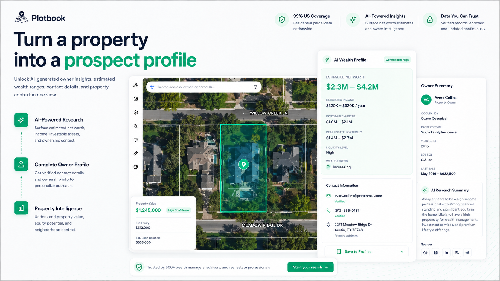
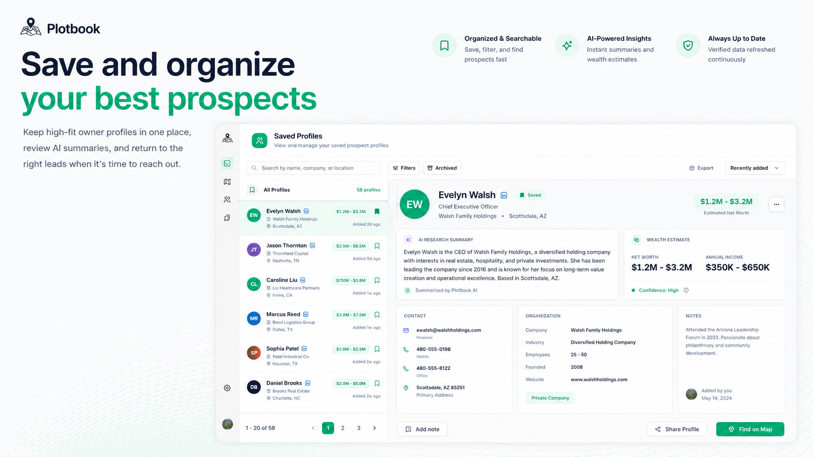

<div align="center">

<a href="https://plotbook.io">
  
</a>

<br /><br />

# [Plotbook](https://plotbook.io)

**Geospatial wealth intelligence for property-first prospecting.**

[](https://plotbook.io)
[](https://plotbook.io)
[](https://plotbook.io)

</div>

---

## What We Build

[Plotbook](https://plotbook.io) is a geospatial wealth intelligence platform that lets wealth managers, financial advisors, and private professionals find high-net-worth property owners — visually, by location, in seconds.

Traditional prospecting tools start with names. **Plotbook starts with property.** Explore a map, identify expensive homes, surface owner profiles, and access net worth estimates and contact data — all in one click.

---

<div align="center">
  
</div>

---

## Core Platform Capabilities

| Capability | Description |
|---|---|
| **Interactive Parcel Map** | Visual map-based prospecting across US neighborhoods |
| **Instant Owner Reveal** | Identify property owners with one click |
| **AI Wealth Estimates** | Net worth ranges and asset summary per profile |
| **Contact Intelligence** | Email, phone, LinkedIn — enriched and verified |
| **Geographic Filters** | Segment by property value, zip code, or metro corridor |
| **Saved Prospect Profiles** | Organize and track high-value leads in one place |

---

## Who Uses Plotbook

- **Private Wealth Advisors** — prospect affluent clients by neighborhood
- **Financial Planners** — build targeted outreach lists from map-based data
- **NGO Fundraisers** — identify high-net-worth donors in specific geographies
- **Insurance Agents** — reach affluent homeowners with precision
- **Real Estate Professionals** — find buyers and sellers in high-value markets
- **B2B Service Providers** — target wealthy neighborhoods for enterprise outreach

---

<div align="center">
  
</div>

---

## Technical Approach

[Plotbook's](https://plotbook.io) platform is built on a property-first data pipeline:

```
Parcel-level GIS data  →  Ownership resolution  →  Wealth enrichment  →  Contact append
```

- **Geospatial layer** — nationwide parcel boundaries, property valuations, and ownership records
- **Wealth intelligence** — AI-derived net worth estimates calibrated against property equity, business ownership, and investment signals
- **Identity resolution** — owner identity matched across public records and enrichment APIs
- **Contact enrichment** — verified email, phone, and social profiles appended to every prospect

The result: a single platform that takes a physical address and returns a complete, actionable prospect profile.

---

## Pricing

| Plan | Price |
|---|---|
| Starter | $150 / month |
| Professional | $300 / month |
| Scale | $500 / month |

Built for advisors who need reliable, repeatable prospecting — not one-off list pulls.

---

<div align="center">

**[Explore Plotbook →](https://plotbook.io)**

*Map-based prospecting tool to find high-net-worth property owners and their contact details.*

</div>
